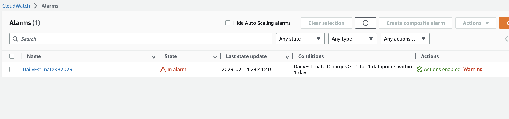
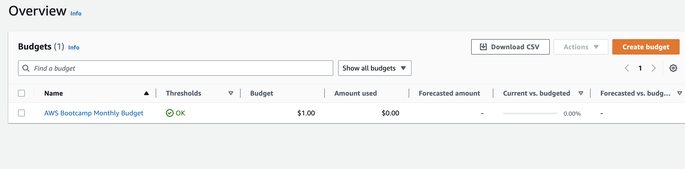
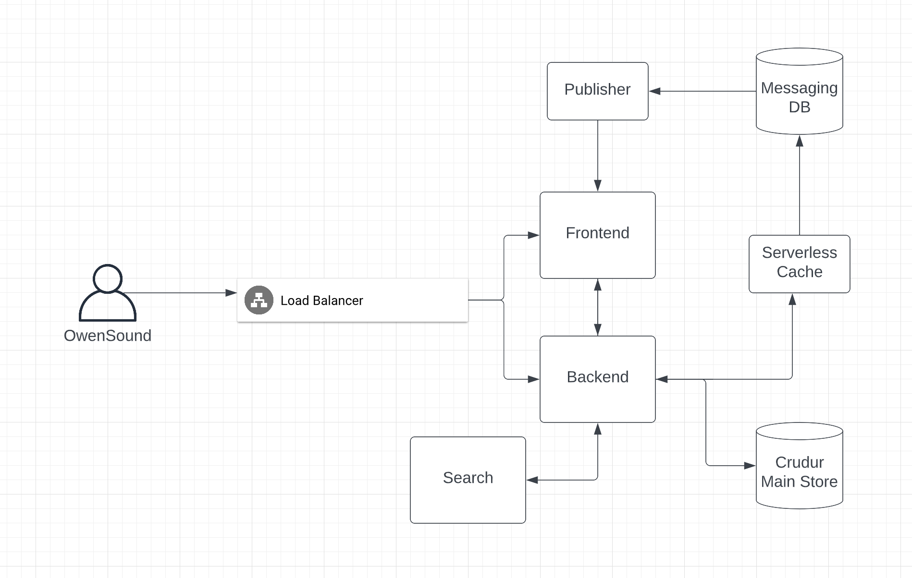
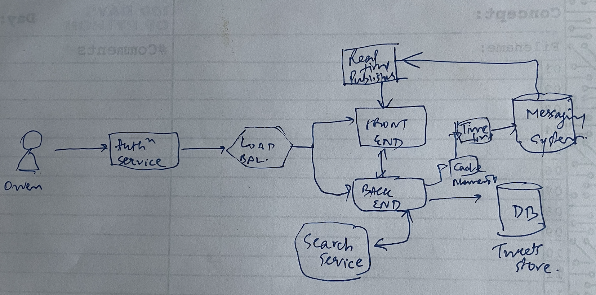
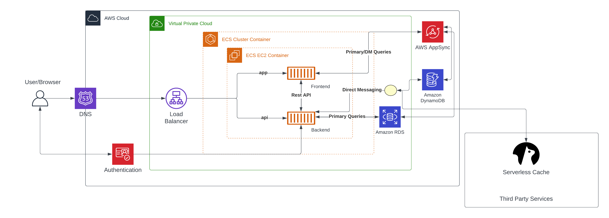
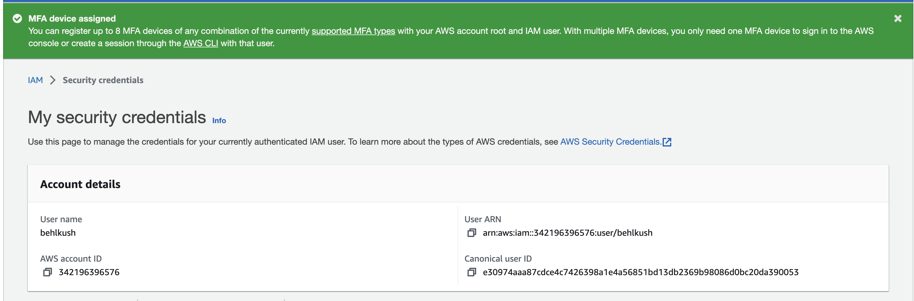

# Week 0 — Billing and Architecture

## gitpod.yml Update

Updated our .gitpod.yml - Also ran the installation steps from CLI and installed Aws cli manually

```
tasks: 
  - name: aws-cli
    env:
      AWS_CLI_AUTO_PROMPT: on-partial
    init: |
      cd /workspace
      curl "https://awscli.amazonaws.com/awscli-exe-linux-x86_64.zip" -o "awscliv2.zip"
      unzip awscliv2.zip
      sudo ./aws/install
      cd $THEIA_WORKSPACE_ROOT
```

**Created new user and Generated AWS Credentials**
Created a user for my account
Enabled console access for the user
Created a new Admin Group and applied AdministratorAccess
Created the user and go find and clicked into the user
Clicked on Security Credentials and Create Access Key
Chose AWS CLI Access
Downloaded the CSV with the credentials

EXPORTED the entries:
```
gp env AWS_ACCESS_KEY_ID="KEYID"
gp env AWS_SECRET_ACCESS_KEY="SECRET KEY"
gp env AWS_DEFAULT_REGION=canada-central-1
```

## Enable Billing -- DONE
We need to turn on Billing Alerts to recieve alerts...

In your Root Account go to the Billing Page
Under Billing Preferences Choose Receive Billing Alerts
Save Preferences


## SNS Topic Creation
```
aws sns subscribe \
    --topic-arn=arn:aws:sns:ca-central-1:MYACCOUNTID:billing-alarm \
    --protocol=email \
    --notification-endpoint=myEMAIL@gmail.com
```
    
## CloudWatch alarm:

Created using:
```
aws cloudwatch put-metric-alarm --cli-input-json file://aws/json/alarm_config.json
```

alarm_config.json - checked in

**Proof of Billing Alarm from AWS Console**



## AWS Budget - DONE
```
aws budgets create-budget
```
Get your AWS Account ID
```
aws sts get-caller-identity --query Account --output text
Supply your AWS Account ID
Update the json files
This is another case with AWS CLI its just much easier to json files due to lots of nested json
aws budgets create-budget \
    --account-id AccountID \
    --budget file://aws/json/budget.json \
    --notifications-with-subscribers file://aws/json/budget-notifications-with-subscribers.json
```

Updated files checked in: budget.json and budget-notifications-with-subscribers.json

**Proof of Budget Creation from AWS Console**


## Most important notes from Chris and Andrew from Week 0 videos
**Conceptual Design:**
	- I got this wonderful idea. Need to do the napkin design
	- I like to start with the user.
	- We want to create a twitter killer. From conceptual standpoint, what are the things that we want our user to be able to do.
	- We know that we need a stateful backend
	- Something in the middle -- to do the thing
	- Then start defining the functionality
	- So this is how we are going to explain our idea to the business person. So we do mention frontend and backend but no need to go into the implementation details
	- Frontend -- to a website
	- How does a business person realize this thing in terms of money.

**Now is the time to go into dumb questions**
	- Will every user have their own identity or anonymous
	- So we need to store the stateful - i.e. tweets from the user as well as identity of the user
	- Important dumb question
		○ How will you prevent DDOS
    
## Conceptual Design - Lucid Chart - Cruddur


## Adding Napkin Diagram too:


## Logical Diagram Coming up:
[Here is a link to my Lucid Digram shown below](https://lucid.app/lucidchart/498e3faf-71f2-4b5a-8f5a-dd542ce8726a/edit?viewport_loc=116%2C-33%2C2219%2C967%2CIxwxtCHfjlC~&invitationId=inv_af526d85-a1d4-41ed-b1f3-ebf2482c8fdd)




# Above and Beyond - Homework Challenges

- I have removed the Root account credentials and added MFA to my IAM Role. 
- 


## Quota increase
- There are service limits to AWS services. I have requested a quota increase for EC2-VPC Elastic IPs from 5 to 10

