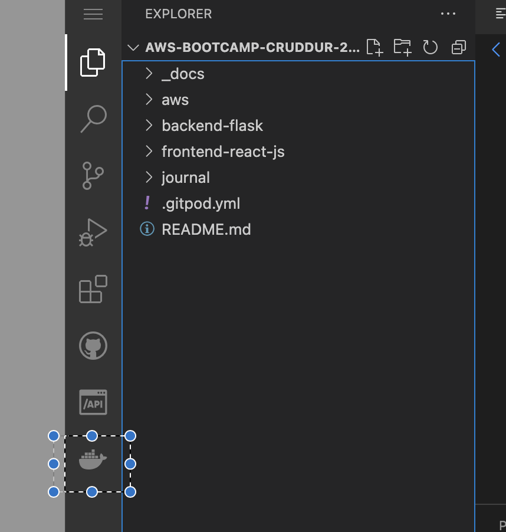

# Week 1 — App Containerization

## Initial set up - Docker
- challenge encountered - whale icon of docker was not visible - as the docker extension was not installed by default on my gitpod.
- went ahead and installed it and its showing now - screenshot below:



## Added Dockerfile

```
FROM python:3.10-slim-buster

WORKDIR /backend-flask

COPY requirements.txt requirements.txt
RUN pip3 install -r requirements.txt

COPY . .

ENV FLASK_ENV=development

EXPOSE ${PORT}
CMD [ "python3", "-m" , "flask", "run", "--host=0.0.0.0", "--port=4567"]

```

In the above docker file: CMD is what is running the flask module of python
-m -> stands for module
flask -> is the module name
run on local host - 0.0.0.0
on port 4567


### Difference between CMD and RUN:
RUN -- makes it the part of the image
CMD -- is that container will run this


## Build container
```
docker build -t  backend-flask ./backend-flask
```

## Run Container
```
docker container run --rm -p 4567:4567 -d backend-flask
```

### --rm option will make the docker to delete all artifacts related to container and clean it


## Containerize Frontend

### Run NPM install
```
cd frontend-react-js
npm i
```

### Create docker file:

```
FROM node:16.18

ENV PORT=3000

COPY . /frontend-react-js
WORKDIR /frontend-react-js
RUN npm install
EXPOSE ${PORT}
CMD ["npm", "start"]
```

Docker file is basically to automate what we are doing above by running npm i -- see RUN npm install statement in docker file.
It means include the install of frontend-js while initializing docker container.


### Build container
```
docker build -t frontend-react-js ./frontend-react-js
```

### Run Container
```
docker run -p 3000:3000 -d frontend-react-js
```


Both containters are build and run. This is fine for 2 containers but to manage the start and run and shutdown of these containers there is a better way coming up below.


## Multiple Containers
Calls for Docker Compose

Docker Compose -- Run multiple containers using yml instead of using multiple containers to manually launch the docker container run commands

```
version: "3.8"
services:
  backend-flask:
    environment:
      FRONTEND_URL: "https://3000-${GITPOD_WORKSPACE_ID}.${GITPOD_WORKSPACE_CLUSTER_HOST}"
      BACKEND_URL: "https://4567-${GITPOD_WORKSPACE_ID}.${GITPOD_WORKSPACE_CLUSTER_HOST}"
    build: ./backend-flask
    ports:
      - "4567:4567"
    volumes:
      - ./backend-flask:/backend-flask
  frontend-react-js:
    environment:
      REACT_APP_BACKEND_URL: "https://4567-${GITPOD_WORKSPACE_ID}.${GITPOD_WORKSPACE_CLUSTER_HOST}"
    build: ./frontend-react-js
    ports:
      - "3000:3000"
    volumes:
      - ./frontend-react-js:/frontend-react-js

# the name flag is a hack to change the default prepend folder
# name when outputting the image names
networks: 
  internal-network:
    driver: bridge
    name: cruddur
  ```


