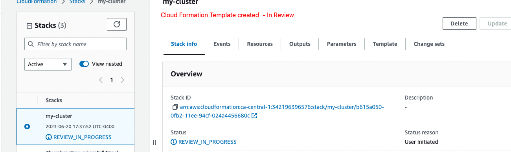
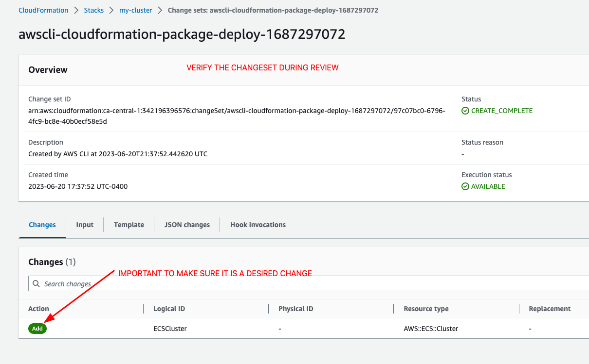
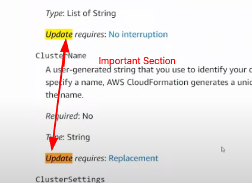

# Video 85: Week 10 — CloudFormation Part 1

## Starting the week by writing a template.yaml file

```yaml
AWSTemplateFormatVersion: "2010-09-09"
```

- its a good idea to have smaller templates with each tier separate

  - easier to debug
  - easier to maintain
  - So make one template each for network layer, database layer and application layer, cluster layer
  - Basic template is ready

```yaml
AWSTemplateFormatVersion: "2010-09-09"

Description: |
  Setup ECS Cluster
# Parameters:
# Mappings:
Resources:
  ECSCluster: #LogicalName
    Type: "AWS::ECS::Cluster"
# Outputs:
# Metadata:
```

# Deploy the template using a bin script

- Deploy script created with the full path to template.yaml and ran successfully

```sh
./deploy

Waiting for changeset to be created..
Changeset created successfully. Run the following command to review changes:
aws cloudformation describe-change-set --change-set-name arn:aws:cloudformation:ca-central-1:342196396576:changeSet/awscli-cloudformation-package-deploy-1687297072/97c07bc0-6796-4fc9-bc8e-40b0ecf58e5d
```

## Verified on AWS account - the template is in review mode as shown below



- Basically its waiting for us to review and approve it.
  

**Things to check**:

- What is being added, replaced, removed?
- Have a look at section **Updates Required:**
  

- If all looks okay then Execute the changeset
  - New option to rollback everything or preserve successful changes - selected rollback everything

## Note: Debugging options

- In case the default messages on Execute changeset are not helpful enough then the place to go is CloudTrail logs

## Validate the template locally:

```sh
aws cloudformation validate-template --template-body file:///Users/kush.behl/Library/CloudStorage/OneDrive-ThomsonReutersIncorporated/Study_2023/bootcamp_aws_andrew_brown/aws-bootcamp-cruddur-2023/aws/cfn/template.yaml
```

## cfn-guard - why to use

- So for validatign the syntax of cfn template you can use cfn-ling, aws cloudformation validate-template, but they are not going to figure out the the internal policies for instance, if you are in an org that prevents any s3 public buckets.
- That is where cfn-guard comes in and can set those policies up and validate a template against those policies that are set.

## Created the CFN artifacts bucket

- And updated deploy script with below code:

```sh
aws cloudformation deploy \
  --stack-name "my-cluster" \
  --s3-bucket "cfn-artifacts-owensound" \
  --template-file $CFN_PATH \
  --no-execute-changeset \
  --capabilities CAPABILITY_NAMED_IAM
```

- the bucket had a new file ending in .template, indicating that the cfn template is stored in s3
- I verified the contents of template file and the cfn template contents are present in that file

# Video 86: Week 10-11 - CFN For Networking Layer
