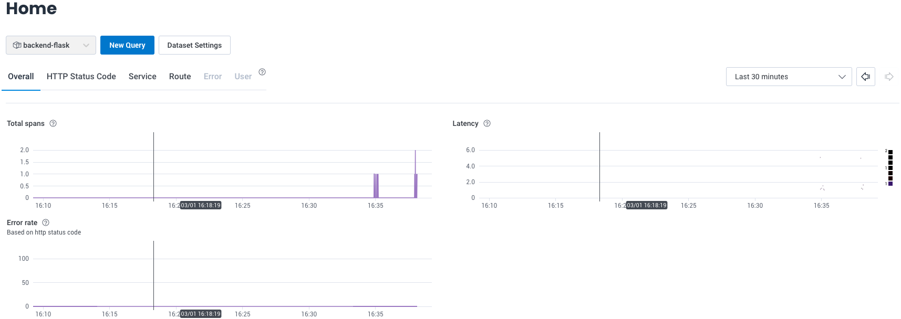

# Week 2 — Distributed Tracing

## Honeycomb
- Successfully set up my honeycomb account and created a new environement: bootcamp


Now exporting variable:
```
export HONEYCOMB_API_KEY = MYKEY
```

Verified from environment:
```
gitpod /workspace/aws-bootcamp-cruddur-2023 (main) $ env | grep HONEYCOMB
HONEYCOMB_API_KEY=MYKEY
```

Set the service name:
```
export HONEYCOMB_SERVICE_NAME="Crudder"
gp env HONEYCOMB_SERVICE_NAME="Crudder"
```

Confirmed that it is set:
```
gitpod /workspace/aws-bootcamp-cruddur-2023 (main) $ env | grep HONEY
HONEYCOMB_API_KEY=MYKEY
HONEYCOMB_SERVICE_NAME=Crudder
```


Added below in the docker-compose.yml under backend service:
```
OTEL_EXPORTER_OTLP_ENDPOINT: "https://api.honeycomb.io"
OTEL_EXPORTER_OTLP_HEADERS: "x-honeycomb-team=${HONEYCOMB_API_KEY}"
OTEL_SERVICE_NAME: "backend-flask"
```

Adding these to requirements.txt: (Honeycomb website tells to install using pip but we are going via: requirements.txt route)

```
opentelemetry-api 
opentelemetry-sdk 
opentelemetry-exporter-otlp-proto-http 
opentelemetry-instrumentation-flask 
opentelemetry-instrumentation-requests
```

And then ran:

```
pip install -r requirements.txt
```

### Initialize honeycomb
Next we update app.py to initialize honeycomb

```
#Honeycomb initialization
from opentelemetry import trace
from opentelemetry.instrumentation.flask import FlaskInstrumentor
from opentelemetry.instrumentation.requests import RequestsInstrumentor
from opentelemetry.exporter.otlp.proto.http.trace_exporter import OTLPSpanExporter
from opentelemetry.sdk.trace import TracerProvider
from opentelemetry.sdk.trace.export import BatchSpanProcessor
```

Initialization steps:
```
# Initialize tracing and an exporter that can send data to Honeycomb
provider = TracerProvider()
processor = BatchSpanProcessor(OTLPSpanExporter())
provider.add_span_processor(processor)
trace.set_tracer_provider(provider)
tracer = trace.get_tracer(__name__)
```

Automatic instrumentation steps:
```
# Initialize automatic instrumentation with Flask
FlaskInstrumentor().instrument_app(app)
RequestsInstrumentor().instrument()
```


Making ports public and open by default. Update .gitpod.yml
```
ports:
  - name: frontend
    port: 3000
    onOpen: open-browser
    visibility: public
  - name: backend
    port: 4567
    visibility: public
  - name: xray-daemon
    port: 2000
    visibility: public
```


Next Made sure that am able to access backend and frontend.

Made some API requests but didn't get any data on honeycomb.
Checked that my environment variable wasn't set. So i had used the correct API key but it was not set as i had reloaded my environment.

Honeycomb is showing data:

