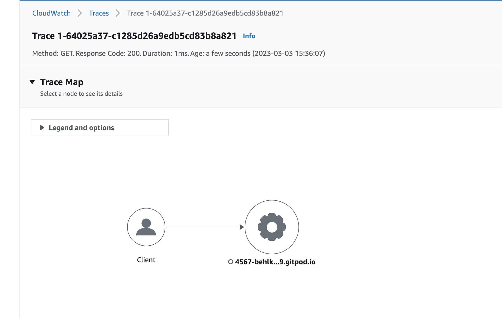
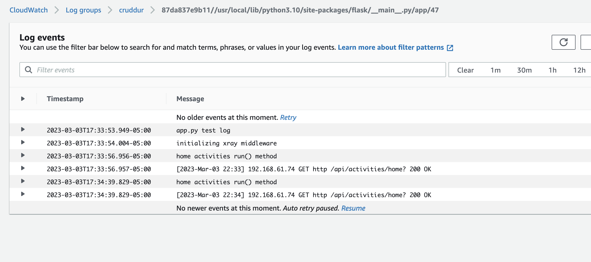

# Week 2 — Distributed Tracing

## Honeycomb
- Successfully set up my honeycomb account and created a new environement: bootcamp


Now exporting variable:
```
export HONEYCOMB_API_KEY = MYKEY
```

Verified from environment:
```
gitpod /workspace/aws-bootcamp-cruddur-2023 (main) $ env | grep HONEYCOMB
HONEYCOMB_API_KEY=MYKEY
```

Set the service name:
```
export HONEYCOMB_SERVICE_NAME="Crudder"
gp env HONEYCOMB_SERVICE_NAME="Crudder"
```

Confirmed that it is set:
```
gitpod /workspace/aws-bootcamp-cruddur-2023 (main) $ env | grep HONEY
HONEYCOMB_API_KEY=MYKEY
HONEYCOMB_SERVICE_NAME=Crudder
```


Added below in the docker-compose.yml under backend service:
```
OTEL_EXPORTER_OTLP_ENDPOINT: "https://api.honeycomb.io"
OTEL_EXPORTER_OTLP_HEADERS: "x-honeycomb-team=${HONEYCOMB_API_KEY}"
OTEL_SERVICE_NAME: "backend-flask"
```

Adding these to requirements.txt: (Honeycomb website tells to install using pip but we are going via: requirements.txt route)

```
opentelemetry-api 
opentelemetry-sdk 
opentelemetry-exporter-otlp-proto-http 
opentelemetry-instrumentation-flask 
opentelemetry-instrumentation-requests
```

And then ran:

```
pip install -r requirements.txt
```

### Initialize honeycomb
Next we update app.py to initialize honeycomb

```
#Honeycomb initialization
from opentelemetry import trace
from opentelemetry.instrumentation.flask import FlaskInstrumentor
from opentelemetry.instrumentation.requests import RequestsInstrumentor
from opentelemetry.exporter.otlp.proto.http.trace_exporter import OTLPSpanExporter
from opentelemetry.sdk.trace import TracerProvider
from opentelemetry.sdk.trace.export import BatchSpanProcessor
```

Initialization steps:
```
# Initialize tracing and an exporter that can send data to Honeycomb
provider = TracerProvider()
processor = BatchSpanProcessor(OTLPSpanExporter())
provider.add_span_processor(processor)
trace.set_tracer_provider(provider)
tracer = trace.get_tracer(__name__)
```

Automatic instrumentation steps:
```
# Initialize automatic instrumentation with Flask
FlaskInstrumentor().instrument_app(app)
RequestsInstrumentor().instrument()
```


Making ports public and open by default. Update .gitpod.yml
```
ports:
  - name: frontend
    port: 3000
    onOpen: open-browser
    visibility: public
  - name: backend
    port: 4567
    visibility: public
  - name: xray-daemon
    port: 2000
    visibility: public
```


Next Made sure that am able to access backend and frontend.

Made some API requests but didn't get any data on honeycomb.
Checked that my environment variable wasn't set. So i had used the correct API key but it was not set as i had reloaded my environment.

Honeycomb is showing data:


Next we add multiple spans in the telemetry by adding below code to home_activities.py
```
from opentelemetry import trace

tracer = trace.get_tracer('home_activities')

```

In Run method enter below code and indent the function accordingly.
```
with tracer.start_as_current_span("home-activities-mock-data"):
```

Now added a custom attribute - that is what makes the spans replace the logs

Update in home_activities.py run method:
```
      span = trace.get_current_span()
      now = datetime.now(timezone.utc).astimezone()
      span.set_attribute("app.now", now)
 
```

Finally after pushing all the changes I have tagged the code:

```
gitpod /workspace/aws-bootcamp-cruddur-2023 (main) $ git tag week2_kb_owensound
gitpod /workspace/aws-bootcamp-cruddur-2023 (main) $ git push --tags
Total 0 (delta 0), reused 0 (delta 0), pack-reused 0
To https://github.com/behlkush/aws-bootcamp-cruddur-2023.git
 * [new tag]         week2_kb_owensound -> week2_kb_owensound
```


# AWS XRAY Integration

### Add npm i in gitpod.yml file so that frontend installs automatically
```
  - name: react-js
    command: |
      cd frontend-react-js
      npm i    
 ```
 
 ### Why is Python SDK called BOTO3
 So i researched about why SDK For python is called boto3. Boto is a popular dolphin in the Amazon River and Python SDK is named after it. (as it is the most popular one)
 
 We are actually using aws-xray-sdk directly
 
 #### Update requirements.txt
 ```
 aws-xray-sdk
 ```
 
 Then run
 
 ```
 pip install -r requirements.txt
 ```
 
 Add XRay code to app.py
 
 ```
 # X-Ray -------------------
from aws_xray_sdk.core import xray_recorder
from aws_xray_sdk.ext.flask.middleware import XRayMiddleware

# X-RAY Initialization
xray_url = os.getenv("AWS_XRAY_URL")
xray_recorder.configure(service='backend-flask', dynamic_naming=xray_url)
XRayMiddleware(app, xray_recorder)
```

Next set up xray json: Add aws/json/xray.json
```
{
  "SamplingRule": {
      "RuleName": "Cruddur",
      "ResourceARN": "*",
      "Priority": 9000,
      "FixedRate": 0.1,
      "ReservoirSize": 5,
      "ServiceName": "backend-flask",
      "ServiceType": "*",
      "Host": "*",
      "HTTPMethod": "*",
      "URLPath": "*",
      "Version": 1
  }
}
```

Next on the shell under backend-flask directory run below commands to create an X-Ray group:
```
FLASK_ADDRESS="https://4567-${GITPOD_WORKSPACE_ID}.${GITPOD_WORKSPACE_CLUSTER_HOST}"
aws xray create-group \
   --group-name "Cruddur" \
   --filter-expression "service(\"backend-flask\")"
```

Issue faced: aws cli not found.

Reloaded my Gitpod environment and it worked.

##### Add a sampling rule -- note below that sampling rule needs to be created from the workspace home directory and not from under backend-flask:
```
gitpod /workspace/aws-bootcamp-cruddur-2023/backend-flask (main) $ aws xray create-sampling-rule --cli-input-json file://aws/json/xray.json

Error parsing parameter '--cli-input-json': Unable to load paramfile file://aws/json/xray.json: [Errno 2] No such file or directory: 'aws/json/xray.json'
gitpod /workspace/aws-bootcamp-cruddur-2023/backend-flask (main) $ cd ..
gitpod /workspace/aws-bootcamp-cruddur-2023 (main) $ aws xray create-sampling-rule --cli-input-json file://aws/json/xray.json
{
    "SamplingRuleRecord": {
        "SamplingRule": {
            "RuleName": "Cruddur",
            "RuleARN": "arn:aws:xray:ca-central-1:342196396576:sampling-rule/Cruddur",
            "ResourceARN": "*",
            "Priority": 9000,
            "FixedRate": 0.1,
            "ReservoirSize": 5,
            "ServiceName": "backend-flask",
            "ServiceType": "*",
            "Host": "*",
            "HTTPMethod": "*",
            "URLPath": "*",
            "Version": 1,
            "Attributes": {}
        },
        "CreatedAt": "2023-03-03T20:01:52+00:00",
        "ModifiedAt": "2023-03-03T20:01:52+00:00"
    }
}
```

**Note**: that there are some things that are added to the code like yml files, jsons and so on and some steps are directly interacting with creating AWS services using the CLI.

##### Set up X-RAY Daemon

X-ray daemon start up to be containerized using docker-compose entry below:

```
  xray-daemon:
    image: "amazon/aws-xray-daemon"
    environment:
      AWS_ACCESS_KEY_ID: "${AWS_ACCESS_KEY_ID}"
      AWS_SECRET_ACCESS_KEY: "${AWS_SECRET_ACCESS_KEY}"
      AWS_REGION: "us-east-1"
    command:
      - "xray -o -b xray-daemon:2000"
    ports:
      - 2000:2000/udp
```

**Note**:  I already figured out the ca-central-1 while typing and had fixed it, so my xray-daemon worked in a single go.

Here is the working trace:


## Cloudwatch logs integration

Update requirements.txt to add below:

```
watchtower
```

Then go into backend-flask dir and run:
```
pip install -r requirements.txt
```

Add the watchtower initializtion in app.py
```
import watchtower
import logging
from time import strftime

# Configuring Logger to Use CloudWatch
LOGGER = logging.getLogger(__name__)
LOGGER.setLevel(logging.DEBUG)
console_handler = logging.StreamHandler()
cw_handler = watchtower.CloudWatchLogHandler(log_group='cruddur')
LOGGER.addHandler(console_handler)
LOGGER.addHandler(cw_handler)
```


Added environment variables in docker-compose.yml
```
      AWS_DEFAULT_REGION: "${AWS_DEFAULT_REGION}"
      AWS_ACCESS_KEY_ID: "${AWS_ACCESS_KEY_ID}"
      AWS_SECRET_ACCESS_KEY: "${AWS_SECRET_ACCESS_KEY}"
```

Further i added logging in home_activities.py and cloudwatch showed up those log statements. I have disabled it as per Andrew's suggestion. The working cloudwatch trace can be seen below:



**Note**: I am not disabling logging yet and also not disabling X-ray, because i do have free credits and will like to use them

## Rollbar Implementation

Requirements.txt changes
```
blinker
rollbar
```

