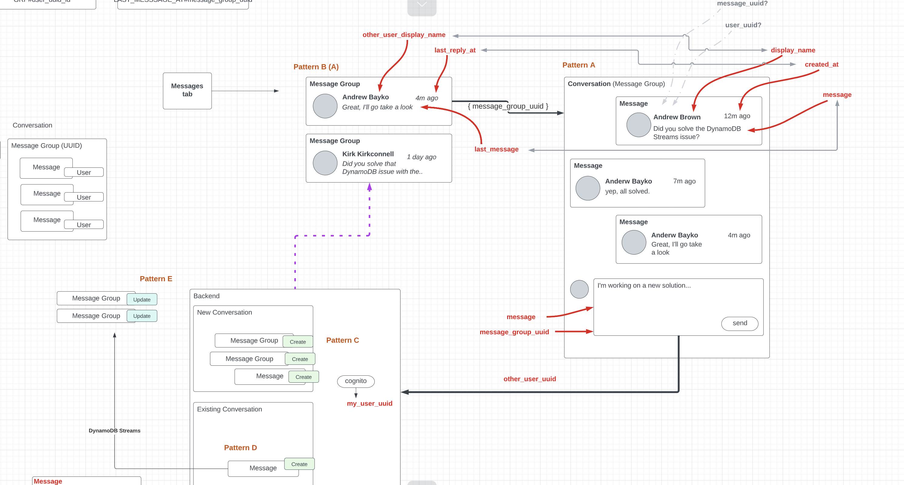

# Week 5 — DynamoDB and Serverless Caching

## Starting DDB week - First I have gone through the initial video on data model design of our DDB tables.

A few key points to note:

- Dynamo DB Important questions before using

  - What data do I need to store
  - When do I need it
  - And how quickly do I need it

- What are my access patterns

  - For our use case, we want to be able to show the most recent message groups and the name of the person whom the conversation is going on
  - And we want it sorted in descending time to show most recent
  - How often I am doing it

- In NoSQL DBs we are modeling our data as per

  - How my application will be using it
  - How my users will be using it
  - What kind of reporting we will be doing
  - What are my access patterns
  - How are you going to interact with your data

In Relational DBs we are modeling tables as Database wants it.

**Data Model Design**



# Environment changes required at my end because I am running everything locally

### DynamoDB Begins
- First of all I enabled Dynamo DB portion in docker-compose.yml

```
  dynamodb-local:
  #   # https://stackoverflow.com/questions/67533058/persist-local-dynamodb-data-in-volumes-lack-permission-unable-to-open-databa
  #   # We needed to add user:root to get this working.
    user: root
    command: "-jar DynamoDBLocal.jar -sharedDb -dbPath ./data"
    image: "amazon/dynamodb-local:latest"
    container_name: dynamodb-local
    ports:
      - "8000:8000"
    volumes:
      - "./docker/dynamodb:/home/dynamodblocal/data"
    working_dir: /home/dynamodblocal
```


### Next I set up the psql related changes to my .devcontainer.json file
```
    },
    "5432": {
      "label": "postgres",
      "onAutoForward": "notify"
    },
    "8000": {
      "label": "DynamoDB",
      "onAutoForward": "notify"
    }
  },
```
Added above 2 ports in the list

#### Work on restructuring and modifying existing db bash scripts and new ddb bash scripts
- Existing scripts moved to a new folder db and there realpath modified to pick up all scripts correctly --> Example below
```
schema_path=$(realpath ../../)/db/schema.sql
```

- Also modified the local psql with the new seed data and for that modified the seed.sql to:
```
-- this file was manually created
INSERT INTO public.users (display_name, email, handle, cognito_user_id)
VALUES
  ('Kiaan Behl', 'behlkiaan@gmail.com', 'behlkiaan' ,'MOCK'),
  ('Owen Sound', 'kushbehl@gmail.com', 'owensound' ,'MOCK');

INSERT INTO public.activities (user_uuid, message, expires_at)
VALUES
  (
    (SELECT uuid from public.users WHERE users.handle = 'owensound' LIMIT 1),
    'This was imported as seed data!',
    current_timestamp + interval '10 day'
  )
```
Note that above command was failing without email entry (as we had modified the schema to have NOT NULL)

- Next moved on to create ddb scripts.
  **seed script**:
  - Did a bit of clean code approach and created a conversations.txt and reading conversation from that instead of directly having it 
    hardcoded in the python bash script. I do it using the below code:
    ``` 
    with open("conversation.txt", "r") as file:
    lines = file.readlines()
    ```

    - I also have a smart logic to detect prod in the passed argument in seed script
    ```
          # unset endpoint url for use with production database
          if "prod" in sys.argv:
            attrs = {}
    ```

- Made all the updates in the seed and got it working.
- Andrew's key point about batch updates: it can result in cost savings when we seed data into production (only if we intended to
do a seed in prod). Dynamo DB can be a costly affair if we do RCUs and WCUs inefficiently.


