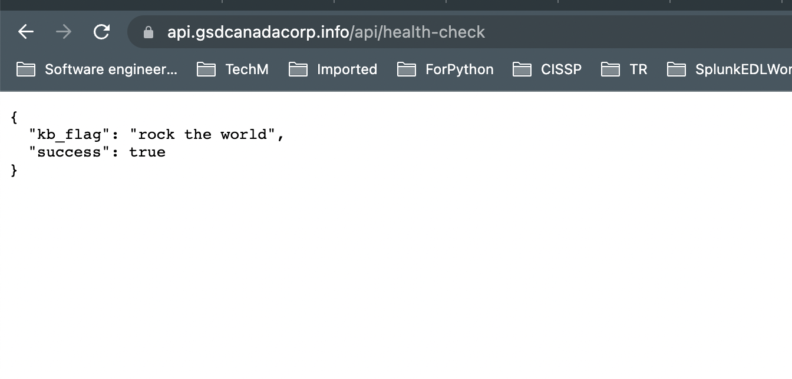

# Week 9 — CI/CD with CodePipeline, CodeBuild and CodeDeploy

# Video 81: FREE AWS Cloud Project Bootcamp (Week 9) - CI/CD

- Create a new code pipeline and for the first time create a new branch called prod in github account

- Build spec file created

```yml
# Buildspec runs in the build stage of your pipeline.
version: 0.2
phases:
  install:
    runtime-versions:
      docker: 20
    commands:
      - echo "cd into $CODEBUILD_SRC_DIR/backend"
      - cd $CODEBUILD_SRC_DIR/backend-flask
      - aws ecr get-login-password --region $AWS_DEFAULT_REGION | docker login --username AWS --password-stdin $IMAGE_URL
  build:
    commands:
      - echo Build started on `date`
      - echo Building the Docker image...
      - docker build -t backend-flask .
      - "docker tag $REPO_NAME $IMAGE_URL/$REPO_NAME"
  post_build:
    commands:
      - echo Build completed on `date`
      - echo Pushing the Docker image..
      - docker push $IMAGE_URL/$REPO_NAME
      - cd $CODEBUILD_SRC_DIR
      - echo "imagedefinitions.json > [{\"name\":\"$CONTAINER_NAME\",\"imageUri\":\"$IMAGE_URL/$REPO_NAME\"}]" > imagedefinitions.json
      - printf "[{\"name\":\"$CONTAINER_NAME\",\"imageUri\":\"$IMAGE_URL/$REPO_NAME\"}]" > imagedefinitions.json

env:
  variables:
    AWS_ACCOUNT_ID: 342196396576
    AWS_DEFAULT_REGION: ca-central-1
    CONTAINER_NAME: backend-flask
    IMAGE_URL: 342196396576.dkr.ecr.ca-central-1.amazonaws.com
    REPO_NAME: backend-flask:latest
artifacts:
  files:
    - imagedefinitions.json
```

# Video 82: Week 9 - Fix CodeBuild Issues

- Above contents are the fixed version of buildspec.yml file.
- As pointed out, env vars like AWS KEY and COGNITO ID etc. are not required to build the code
- Also the docker version needed to be 20 and not 19.
- There was one issue that came - The CodeBuild didn't have access to ECR and was failing so i had to edit the service role of CodeBuild to include permissions to update ECR

```json
{
  "Version": "2012-10-17",
  "Statement": [
    {
      "Sid": "VisualEditor0",
      "Effect": "Allow",
      "Action": [
        "ecr:BatchCheckLayerAvailability",
        "ecr:CompleteLayerUpload",
        "ecr:GetAuthorizationToken",
        "ecr:InitiateLayerUpload",
        "ecr:PutImage",
        "ecr:UploadLayerPart",
        "ecr:BatchGetImage",
        "ecr:GetDownloadUrlForLayer"
      ],
      "Resource": "*"
    }
  ]
}
```

- With the correct buildspec.yml the CodeBuild succeeded

# Video 83: Week 9 - CodePipeline

- Added a build stage in Code Pipeline

- Fixed CodeBuild to output artifact named ImageDefinition
- Updated Deploy Stage of pipeline to use the above ImageDefinition artifact.
- Updated buildspec.yml to cd into the project root

```sh
- cd $CODEBUILD_SRC_DIR
```

- Next i made a code change in api- health-page (https://api.gsdcanadacorp.info/api/health-check) and that triggered the pipeline
- Ran my api path for health check again and succeeded.



# This is probably the easiest week ever.

# Tagged My work

```sh
git tag week9 origin
git push --tags
```

# Homework

## Trying to automate build for frontend

```yaml
# Buildspec runs in the build stage of your pipeline.
version: 0.2
phases:
  install:
    runtime-versions:
      docker: 20
    commands:
      - echo "cd into $CODEBUILD_SRC_DIR/frontend-react-js"
      - cd $CODEBUILD_SRC_DIR/frontend-react-js
      - aws ecr get-login-password --region $AWS_DEFAULT_REGION | docker login --username AWS --password-stdin $IMAGE_URL
  build:
    commands:
      - echo Build started on `date`
      - echo Building the Docker image...
      - docker build \
        --build-arg REACT_APP_BACKEND_URL="https://api.gsdcanadacorp.info" \
        --build-arg REACT_APP_AWS_PROJECT_REGION="$AWS_DEFAULT_REGION" \
        --build-arg REACT_APP_AWS_COGNITO_REGION="$AWS_DEFAULT_REGION" \
        --build-arg REACT_APP_AWS_USER_POOLS_ID="ca-central-1_Sn1lgzw8T" \
        --build-arg REACT_APP_CLIENT_ID="34fjuf4h7vmu9fc2s5niu5uo11" \
        -t frontend-react-js \
        -f "$FRONTEND_REACT_JS_PATH/Dockerfile.prod" \
        .
      - "docker tag $REPO_NAME $IMAGE_URL/$REPO_NAME"
  post_build:
    commands:
      - echo Build completed on `date`
      - echo Pushing the Docker image..
      - docker push $IMAGE_URL/$REPO_NAME
      - cd $CODEBUILD_SRC_DIR
      - echo "imagedefinitions.json > [{\"name\":\"$CONTAINER_NAME\",\"imageUri\":\"$IMAGE_URL/$REPO_NAME\"}]" > imagedefinitions.json
      - printf "[{\"name\":\"$CONTAINER_NAME\",\"imageUri\":\"$IMAGE_URL/$REPO_NAME\"}]" > imagedefinitions.json

env:
  variables:
    AWS_ACCOUNT_ID: 342196396576
    AWS_DEFAULT_REGION: ca-central-1
    CONTAINER_NAME: frontend-react-js
    IMAGE_URL: 342196396576.dkr.ecr.ca-central-1.amazonaws.com
    REPO_NAME: frontend-react-js:latest
artifacts:
  files:
    - imagedefinitions.json
```
